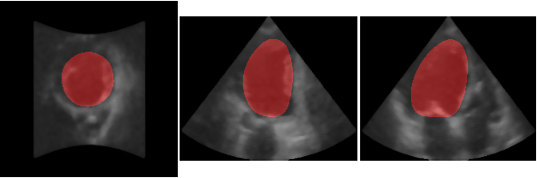
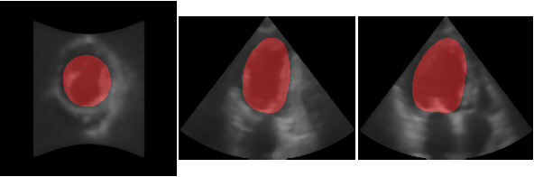

CETUS Challenge: Autocontext Random Forests
===========================================

Code used for the CETUS Challenge, MICCAI 2014.

The Random Forest code is in C++, wrapped with Cython, with the autocontext loop
performed in Python.

Data
----

The training and test data can be downloaded from the challenge evaluation platform after
creation of an account:

https://miccai.creatis.insa-lyon.fr/miccai/

The ground truth for the test data is not provided and the segmentation results are evaluated by uploading the corresponding meshes on the online platform.

After downloading the data, the first step is to preprocess it:

 - convert the images (*.mhd/*.raw) and the ground truth meshes (*.vtk) to the NIfTI format;
 - resample to isotropic resolution (1mm by 1mm by 1mm);
 - denoise: during the challenge, non-local means denoising was used, but the corresponding Matlab code is not provided here, instead a simple median filtering is used. 
 
The conversion can be done using the scripts [`convert.py`](https://github.com/BioMedIA/python-irtk/tree/master/scripts/convert.py) and [`polydata2nifti.py`](https://github.com/BioMedIA/python-irtk/tree/master/scripts/polydata2nifti.py), provided with python-irtk. This `scripts/` directory must be added to your `$PATH` (for instance in your .bashrc). The resampling can be done with the binary `resample` that comes with IRTK (make sure it is on your `$PATH` as well (which should be the case if you installed IRTK through `conda`).
The script [`convert.sh`](https://github.com/kevin-keraudren/CETUS-challenge/blob/master/convert.sh) can be used to perform all the steps of this preprocessing.

Create a folder `Images/` then copy all the folders Patient* into it.
Similarly, create a folder `Truth/` and copy all the *.vtk meshes into it.
Then run `convert.sh` and all the data will be converted in the folder `nifti/`, 
`nifti_resampled/` and `denoised/` .

Compile the code
----------------

Install the necessary dependencies:

    conda install boost opencv cython joblib
    conda install -c kevin-keraudren python-irtk

Run:

    cd forest && make

Training the detector
---------------------

Fiddle with the parameters in the params dictionary, then run:

    python train.py

An already trained detector is provided in forest_615_{0..5}
and corresponds to the model used during the challenge.

Creating a submission for the challenge
---------------------------------------

Run:

     ./predict_all_frames.sh 30 45  # give the same ID twice to run only this subject
	 ./make_submission.sh 4 # this argument is the number of autocontext iterations

Note that `mcubes` from IRTK is used in `make_submission.sh` to create a mesh from a NiFTI volume 
using the marching cubes algorithm, so make sure it is on your `$PATH` as well.

This [gist](https://gist.github.com/kevin-keraudren/61b248a8994f5aea8737) can be used to take screenshots of the error meshes opened with VTK.

The script `show.py` can be used to make visualisations of the resulting segmentation:

         

Acknowledgements
----------------

The code cython code of the geodesic distance distance transform has been written 
by Dr. Zehan Wang as part of [spatial-pbs](https://github.com/iZehan/spatial-pbs).

References
----------

Keraudren, K.,  Oktay, O., Shi, W., Hajnal, J.V., &
Rueckert, D.: <i>Endocardial 3D Ultrasound Segmentation
using Autocontext Random Forests</i>, CETUS Challenge, MICCAI 2014.              
<a href="http://www.doc.ic.ac.uk/~kpk09/publications/MICCAI-2014-CETUS_autocontext.pdf">PDF</a>
<a href="https://www.youtube.com/watch?v=NrxkWXBj5q0">video</a>
<a href="http://www.doc.ic.ac.uk/~kpk09/publications/MICCAI-2014-CETUS_autocontext_poster.pdf">poster</a>
<a href="http://www.doc.ic.ac.uk/~kpk09/publications/MICCAI-2014-CETUS_autocontext_slides.pdf">slides</a>

